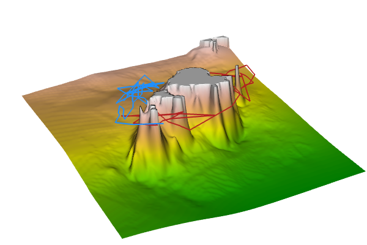
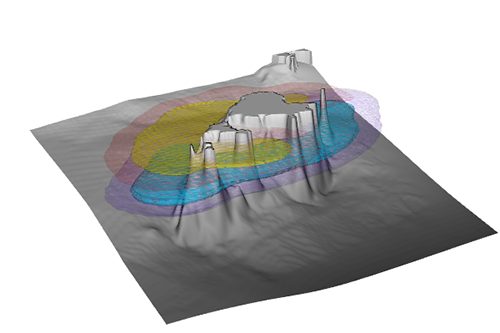
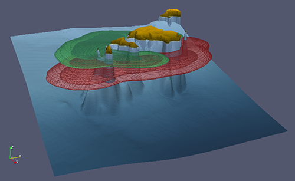

```{r setup, include = FALSE}
knitr::opts_chunk$set(
  collapse = TRUE,
  comment = ">"
)
```

\vspace{3em}

# Introduction

This document is a step-by-step guide to estimate 3D utilization distributions (3D-UDs) from passive acoustic telemetry data in `R`, following the new numerical method proposed in [Reference]. The main novelty of this method is that it takes into account the detection probability around receivers, which is empirically determined, and integrates the depth information from transmitters and the local topography. The method simulates large numbers of stochastic trajectories (synthetic paths) that are then assembled to estimate space use probabilities. All the procedure explained here is carried out with an openly available sample dataset.


##  Sample dataset

All the neccesary functions and a sample dataset are distributed together with the `fishtrack3d` package (<https://github.com/aspillaga/fishtrack3d>).

The following data objects are provided:

- **`tracking`:** Passive acoustic telemetry data from two common dentex (*Dentex dentex*) individuals ('dentex18' and 'dentex43') in the Medes Islands marine protected area (Catalonia, NW Mediterranean Sea). The tracking period took place from 01/Oct/2007 to 31/Dec/2007. Movements were tracked with a fixed array of 17 acoustic receivers.

- **`receivers`:** Geographical coordinates of the 17 acoustic receivers used in the acoustic telemetry study (see image below). Coordinates are in UTM, referred to the datum WGS84 zone 31N.

- **`bathymetry`:** Bathymetric raster map (class `RasterLayer`) of the study area (see image below). It has a resolution of 10x10 m and a total extension of 221x221 cells. Land areas are denoted by `NA` values. The coordinates are in UTM, referred to the datum WGS84 zone 31N.

- **`range_test`:** Data from an acoustic range test performed in the study area. The data frame contains the hourly percentages of signals detected by receivers placed at different distances from one acoustic transmitter during a 24 h period.

\vspace{2em}

```{r plot_bathy, echo = TRUE, fig.align = "center", fig.width = 5.8, fig.height = 5, out.width = "70%", warnings = FALSE, messages = FALSE}
library(fishtrack3d)
library(raster)
library(plyr)
library(ks)

plot(bathymetry, col = terrain.colors(100))
points(receivers$long.utm, receivers$lat.utm, pch = 16, cex = 0.8)
text(receivers$long.utm, receivers$lat.utm, labels = receivers$id, pos = 4)
```

\vspace{1em}

One additional object, which is created in one steps during the application of the method, is also provided. Despite we provide all the code to create it, one may want to skip this step when following this guide, as it requires the external software `GRASS`.

- **`viewshed`:** Raster map representing the pixels outside acoustic shadows and their horizontal distance to receivers. It is a `RasterStack` object with one layer for each receiver, and is generated using `GRASS` during the *Empirical characterization of detection probabilities* (Step 1.2).


# General overview of the method

The process to estimate 3D-UDs is divided in three sequential steps:

1. **Empirical characterization of detection probabilities: **Data from an acoustic range test and the local topography are used to characterize the spatial probability of being detected by each receiver.

2. **Simulation of synthetic path realizations: **A large number of stochastic trajectories are simulated from the acoustic telemetry data, taking into account the characterization of the acoustic performance, the depth values, and the local topography.

3. **Assemblage of utilization distribution volumes: **3D-UDs are estimated from the spatial occurrence of all the synthetic path realizations within a 3D grid in which the study site has been divided.


## Step 1: Empirical characterization of detection probabilities

In this step, we are going to characterize the acoustic performance of the receiver array, by modelling the detection probability depending on the distance to the receiver and detecting acoustic shadow areas using the viewshed analysis.


### 1.1. Modelling the acoustic range

The probability of detecting an acoustic signal decreases when increasing the distance between the transmitter and the receiver. This is because acoustic signals gradually lose their power while travelling through water, making them more susceptible to be interferred by environmental noise, and finally becoming undetectable for acoustic sensors. There is a critical distance, known as the detection range, at which most of the emitted signals are no longer detected by receivers. Assesing the average detection range is highly important to design a receiver array before the experiment, but also for the posterior interpretation of the data. This range is often tested by placing receivers at increasing distances from a receiver and calculating the ratio of signals that arrives to each distance.

The `range_test` data frame contains data from one range test performed in the study site in 2013. The data frame represents the ratio of signals detected (`det.ratio`) by receivers (`rec.id`) at different distances (`dist.m`) during one hour intervals.

\vspace{2em}

```{r load_range-test}
head(range_test)
```

\vspace{2em}

We adjust a logistic regression model to get the probability distribution of being detected as function of the distance.

\vspace{2em}

```{r glm}
range.mod <- glm(det.ratio ~ dist.m, data = range_test, 
                 family = quasibinomial(logit))
```

\vspace{2em}

We can plot the data to see the fit of the function:

\vspace{2em}

```{r glm_plot, fig.align = "center", fig.height = 4.2, fig.width = 5.9, out.width = "80%"}
plot(det.ratio ~ dist.m, data = range_test, xlim = c(0, 400),
     ylab = "Percentage of detections", 
     xlab = "Distance from receiver (m)")
lines(1:400, predict(range.mod, data.frame(dist.m = 1:400), type = "response"),
      type = "l", col = "firebrick", lwd = 2)
```

\vspace{2em}

### 1.2. Acoustic shadows

In this step, we are going to characterize acoustic shadow areas, i.e. areas from which acoustic signals can not be detected by a receiver, within our receiver array. Acoustic shadows are generated by the presence of prominent physical obstacles in the study area, which impede the signal transmission between transmitters and receivers. Here, we will onli identify the most evident acoustic shadow areas, those hindered by emerged landmasses. This is done by applying a *viewshed* analysis to the `bathymetry` raster. The viewshed analysis determines the areas of the terrain that are visible from a specific location, but it is also applicable to the propagation of acoustic signals in water (in our case, the specific locations are the positions of the receivers). As we are interested in only excluding the acoustic shadows generated by emerged landmasses, we will magnify the height of land cells in the `bathymetry` raster before computing the viewshed.

At the same time, we will calculate the lineal distance (in 2D) between each receiver and all the raster cells outside acoustic shadow areas. This distance will be used later, after adding the vertical component (during the simulation of synthetic paths in *Step 2.2*), together with the acoustic range model (created in *Step 1.1*) to obtain the detection probabilities of being detected around each of the receivers.

\par

**NOTE: **Setting `GRASS` to work within `R` might not be very straightforward. You can skip this step if you are going to follow this vignette only with the example dataset, as the result of this step, the object `viewshed`, is already provided in the `fishtrack3d` package. But if you want to use your own telemetry and topography data, I encourage you (and wish you good luck) to make `R`, `GRASS` and `rgeos` understand each other!

\vspace{2em}

```{r dist_shadow, eval = FALSE}
library(rgrass7)

# In the bathymetry raster, NA values correspond to emerged areas.
# We will exaggerate the height of these areas to make sure
# everything behind them is removed in the viewshed analysis
elevation <- bathymetry
elevation[is.na(elevation)] <- 1e+10
elevation <- as(elevation, "SpatialPixelsDataFrame")


# Initialize GRASS session
initGRASS("/Applications/GRASS-7.0.app/Contents/MacOS/",
          home = tempdir(), override = TRUE)

# Load the elevation raster in GRASS
writeRAST(x = elevation, vname = "elevation", overwrite = TRUE)

# Set the region for the analysis
execGRASS("g.region", parameters = list(raster = "elevation"))

# Loop for each receiver
viewshed <- lapply(receivers$id, function(i) {
  
  # Coordinates of the receivers
  coord <- as.numeric(receivers[receivers$id == i, 2:3])
  
  # Execute the 'viewshed' analysis
  #=================================
  execGRASS("r.viewshed", flags = c("overwrite", "b", "quiet"),
              parameters = list(input = "elevation",
                                output = "viewshed",
                                coordinates = coord,
                                target_elevation = 500))

  # Export raster from GRASS and assign NA values and a projection
  rast.tmp <- raster(readRAST("viewshed"))
  proj4string(rast.tmp) <- proj4string(elevation)
  rast.tmp[rast.tmp == 0 | is.na(bathymetry)] <- NA
  
  
  # Calculate distances from receivers to each raster cell
  #========================================================
  distances <- sqrt((coordinates(rast.tmp)[, 1] - coord[1])^2 + 
                      (coordinates(rast.tmp)[, 2] - coord[2])^2)  
  rast.tmp[!is.na(rast.tmp)] <- distances[!is.na(values(rast.tmp))]
  
  return(rast.tmp)
})

raster::names(viewshed) <- raster::validNames(receivers$id)
viewshed <- raster::stack(viewshed)
```

\vspace{2em}

This is how the viewshed analysis looks like for each receiver. The yellowish the colour, the greater the distance from the receiver. White parts of the plots represent acoustic shadows caused by emerged landmasses (in grey):

\vspace{2em}

```{r viewshed_plot, echo = FALSE,  fig.align = "center", fig.height = 7.8, fig.width = 6}
library(raster)

# Plot the islands
islands <- bathymetry
values(islands) <- ifelse((is.na(values(bathymetry))), 1, NA)

par(mfrow = c(5, 4), mar = c(0.3, 0.3, 0.3, 0.3))

for (i in names(viewshed)) {
  image(viewshed[[i]], axes = FALSE, ann = FALSE, asp = 1)
  indx <- validNames(receivers$id) == i
  image(islands, col = tCol("black", 40), add = TRUE)
  points(receivers[indx, 2:3], pch = 16, cex = 2)
  text(receivers[indx, 2:3], labels = receivers$id[indx], pos = 4, cex = 2)
  bbox <- bbox(viewshed)
  rect(xleft = bbox[1, 1], xright = bbox[1, 2], ybottom = bbox[2, 1], 
       ytop = bbox[2, 2])
}
```


## Step 2: Simulation of synthetic path realizations

The provided object `tracking` contains acoustic telemetry data of two common dentex (*Dentex dentex*) individuals in the Medes Islands marine protected area. The object is a data frame where each row corresponds to one signal. The `rec.id` column indicates the ID of the receiver that detected each signal, and the `tag.id` column the ID of the detected individual (in this case there are two individuals, `dentex18` and `dentex43`). `time.stamp` and `depth` columns indicate, respetively, the date and time (in UTC) and the depth of the fish when the detection occurred. In total, the data frame contains 61,528 detections that took place between October 1 and December 31 2007. For this experiment, transmitters were programmed to emit signals at random intervals between 80 and 180 seconds (to reduce the probability of collision between signals).

\vspace{2em}

```{r data_load, eval = TRUE, warning = FALSE}
head(tracking)

# We will split the data into a list to make it easier to apply the
# method to both individuals at the same time
tracking.list <- split(tracking, tracking$tag.id)

# Names of the individuals
names(tracking.list)
```

\vspace{1em}

### 2.1 Thin telemetry data

In this first step, we will thin acoustic telemetry data into 30-minute intervals using the `thinData` function. This function aggregates the data in regular time intervals, and then assigns to each one a receiver and a depth value. The receiver is randomly selected among the receivers that detected the individual within a time-interval, weighted with the amount of detections in each receiver. The depth value is sampled from a probability distribution of the depth values that where registered during the same time interval. This procedure allows to reduce the number of data to be processed, and hence the computation time, but maintains the variability of the original data. 

\vspace{2.5em}

```{r 30minTable, eval = TRUE, message = FALSE}
t30min <- lapply(tracking.list, thinData, time.int = "30min")

# We thin the data twice to later check the variability
t30min.2 <- lapply(tracking.list, thinData, time.int = "30min")

head(t30min[["dentex18"]])

head(t30min.2[["dentex18"]])
```

\vspace{1.5em}

We can make some plots to compare the receivers in two different thinned data frames.

\vspace{1.5em}

```{r spatialCronoPlot, eval = TRUE, echo = TRUE, message = FALSE, fig.align = "center", fig.width = 8.8, fig.height = 7, out.width="70%", dev="png"}
par(mfrow = c(2, 1), mar = c(3.1, 4.1, 3.1, 5.1))
for (i in names(tracking.list)) {
  t30.tmp <- list(t30min[[i]], t30min.2[[i]])
  for(x in 1:length(t30.tmp)) {
    spatChronPlot(time.stamp = t30.tmp[[x]]$time.stamp,
                  rec.id = factor(t30.tmp[[x]]$rec.id, levels = receivers$id))
    title(main = paste(i, "- Simulation", x))
  }
}
```

\vspace{1.5em}

We can also see the comparison between depth values from the two thinned data frames.

\vspace{1em}

```{r depth, eval = TRUE, echo = TRUE, fig.align = "center", fig.width = 6.8, fig.height = 5, out.width="75%"}
par(mfrow = c(2, 1), mar = c(3.1, 4.6, 2.1, 2.1))
for (i in names(tracking.list)) {
  plot(t30min[[i]]$time.stamp, -t30min[[i]]$depth, type = "l",
       xlab = "Date", ylab = "Depth (m)", col = tCol("black", 40), main = i)
  lines(t30min.2[[i]]$time.stamp, -t30min.2[[i]]$depth, 
        col = tCol("firebrick", 40))
  legend("bottomleft", legend = c("Simulation 1", "Simulation 2"), cex = 0.9,
         col = tCol(c("black", "firebrick"), 40), lty = 1, bty = "n")
}
```


### 2.2. Sampling synthetic path realizations

The `syntPath` function generates synthetic path realization by sampling the geographic coordinates for each detection in the acoustic telemetry data, taking into account the following things:

- **Distance from the receiver: **The function calculates the relative probability of being detected by each receiver in each of the cells of the topographic raster. This is done by applying the the acoustic-range logistic model (generated in *Step 1.1*) to the distances between receivers and raster cells that were calculated in the `viewshed` object (generated in *Step 1.2*). The vertical distance is also considered by adding the depth difference between the receiver and the depth value of each detection before applying the logistic model.

- **Distance from the previous sampled coordinates: **In order to avoid unlikely movements between distant locations in short periods of time, the sampling of a pair of coordinates is restricted to a certain distance around the previous position. This is especially useful if the fish is moving halfway between two receivers and detections rapidly alternate from one to the other, which could led to extremely rapid movements between the extremes of the two acoustic ranges. In this case, by restricting the maximum distance, the position of the individual will be forced to be closer to the space between receivers. The maximum distance is defined using the `max.vel` argument of the `syntPath` function, which limits the average maximum speed (in m·s^-1^) that the fish is assumed to reach along the synthetic trajectory. Therefore, taking into account the `max.vel` value and the elapsed time from the previous detection, a maximum distance is determined, beyond wich the probability of detecting the individual is set to zero. To consider this distance, the shortest distances from the previous location to the rest of the raster cells is calculated taking into account and avoiding the landmasses.

- **Shortest path between sampled coordinates: **After sampling two pairs of coordinates, the function finds the shortest path connecting them taking into account the topography. By default, the only restriction to compute the shortest path is not to cross land areas. However, if the `depth.cost.list` argument is provided, the paths will not cross cells shallower than the minimum depth of the points to join. The object given to `depth.cost.list` must contain a list with one element for each 1 m depth interval (between 0 and the maximum depth of the study area). Each element in that object is a `TransitionLayer`, generated with the `gdistance` package, which excludes all the cells placed in areas shallower than the depth that gives the name to the element in the list. The `depth.cost.list` object can be created using the `leastCostMap` function as in the following code. 

\par

**NOTE: **Running this piece of code is quite slow, if you want to follow this vignette only to to see how this method works, you can skip this step and run the `syntPath` function setting the `depth.cost.list` as `NULL`. By doing this, the resulting synthetic paths will avoid emerged land areas, but not the submerged ones.

\vspace{2em}

```{r depth_cost_matrix, echo = TRUE, eval = FALSE}
# Select depth intervals to compute the matrix
depths <- 0:70

depth_cost_list <- lapply(depths, function(x) {
  leastCostMap(topo = bathymetry, min.depth = x)
})

names(depth_cost_list) <- 0:70
```

\vspace{2em}

Now, to see how the `syntPath` function works, we will apply it to the first 50 positions of our thinned tracks.

\vspace{2em}

```{r path_reconstrunction, eval = FALSE, message = FALSE}
synthetic.path <- lapply(t30min, function(data.frame) {
  
  # Remove receiver NAs and missing depths (if there are NAs).
  # We will run the example with only the first 50 positions
  df <- subset(data.frame, !is.na(depth))[1:50, ]
  
  path <- syntPath(track.data = df, topo = bathymetry, dist.rec = viewshed, 
                   ac.range.mod = range.mod, depth.cost.list = depth_cost_list,
                   max.vel = 1, check = F)
})

head(synthetic.path[[1]])
```

```{r get_reconstr_from_simu, eval = TRUE, include = FALSE}

# To avoid computing the simulations above, we take them directly from the
# 'synt_path_x100' object
load("./synt_path_x100.rda")
synthetic.path <- lapply(synt_path_x100, function(l) {
  return(l[[1]][1:50, ])
})

head(synthetic.path[[1]])
```

\vspace{2em}

The resulting data.frame adds the sampled `x` and `y` coordinates to the acoustic telemetry data. Moreover, it interpolates the additional coordinates that define the shortest paths between locations around land barriers. The `type` column indicates if the location correspond to one of the receivers in the initial dataset (`original`) or if it has been interpolated (`interp`).

Now we can take a look at the path in two and three dimensions:

\vspace{2em}

```{r path_plot2D, eval = TRUE, fig.align = "center", fig.width = 5.2, fig.height = 4.8}
# Plot in two dimensions
#========================
image(bathymetry, col = terrain.colors(50), asp = 1, ann = FALSE, 
      axes = FALSE)
lines(synthetic.path[[1]][, c("x", "y")], col = "firebrick", lwd = 1.2)
lines(synthetic.path[[2]][, c("x", "y")], col = "dodgerblue", lwd = 1.2)
legend("topright", legend = names(synthetic.path), lty = 1, bg = "white",
       col = c("firebrick", "dodgerblue"))
```

```{r path_plot3D, eval = FALSE}

# Plot in three dimensions (with the 'rgl' package)
#===================================================
library(rgl)

# Create the matrix to plot the bathymetry
x <- unique(coordinates(bathymetry)[, 1])
y <- unique(coordinates(bathymetry)[, 2])
z <- matrix(values(bathymetry), ncol = length(x))
z[is.na(z)] <- 0

# Prepare the color scale for bathymetry
zlim <- range(z, na.rm = TRUE)
zlen <- round(zlim[2] - zlim[1] + 1)
col <- c(terrain.colors(zlen)[z - zlim[1] + 1])

# Set the display matrix (manually obtained to get the desired view)
mat <- matrix(c(0.48, 0.88, -0.06, 0.00, -0.30, 0.23, 0.93, 0.00, 
                0.83, -0.42, 0.37, 0.00, 0.00, 0.00, 0.00, 1.00), 
              nrow = 4, byrow = TRUE)

open3d(scale = c(1, 1, 10), windowRect = c(0, 0, 600, 400))
rgl.viewpoint(userMatrix = mat, zoom = 0.65, fov = 30)
rgl.pop("lights") 
light3d(specular="black") 
surface3d(x, y, z, col = col)
lines3d(x = synthetic.path[[1]]$x, y = synthetic.path[[1]]$y, 
        z = -synthetic.path[[1]]$depth, lwd = 2, col = "firebrick")
lines3d(x = synthetic.path[[2]]$x, y = synthetic.path[[2]]$y, 
        z = -synthetic.path[[2]]$depth, lwd = 2, col = "dodgerblue")
```

``` {r 3d_path_vis, eval = FALSE, echo = FALSE}
rgl.snapshot("./3d_traj.png", fmt = "png", top = TRUE)
```

{width=80%}

\vspace{3em}

Arrived to this point, we are interested in generating a large number of stochastic trajectories from our original radiotracking data. We will do this by applying the `thinData` and the `synthPath` functions sequentially, as many times as synthetic trajectories we want. We can do this process using parallel computing with the `llply` function of the `plyr` package.

\par

**NOTE: **This part of the code can take a long time. You can reduce the number of iterations or the number of locations to process to make it faster.

\vspace{2em}

``` {r simulations, eval = FALSE}
library(doMC)
doMC::registerDoMC(cores = 18) # Set number of cores to parallelize

synt_path_x100 <- lapply(tracking.list, function(df) {
  
  sim.ind <- plyr::llply(1:100, .parallel = TRUE, function(x) {
     
    # Print individual and current simulation number
    cat(df$tag.id[1], "synthetic track no.", x, "\n") 
    
    t30min <- thinData(df, time.int = "30min", depth.range = c(0, 69))
    t30min <- subset(t30min, !is.na(depth))
    
    synthetic.path <- syntPath(track.data = t30min, topo = bathymetry,
                               dist.rec = viewshed, ac.range.mod = range.mod, 
                               depth.cost.list = depth_cost_list, max.vel = 1)
    return(synthetic.path)
  })
})
```


## Step 3. Assemblage of utilization distribution volumes

In this step, we are going to merge all the synthetic paths to generate a 3D utilization distribution (3D-UD) volume. We will do this with the `voxelize` function, which divides our study area in a 3D grid, and then calculates the average number of time that the synthetic trajectories spend in each one of the resulting voxels. Voxels are defined with the horizontal resolution (x and y) of a provided raster dataset, which will usually be the same topographic raster that has been previously used (in our case, it has a resolution of 10 x 10 m). The vertical (z) resolution is provided as a vector with the depth values that define the breaks into which the z axis will be cut (in this case, we will use a resolution of 1 m).

The `voxelize` function first divides each path into a large number of points, in order to ensure that there will be points falling in each of the voxels that have been crossed by the trajectory. Then, it calculates the proportion of points that fell within each voxel for each synthetic trajetory. Finally, it calculates the average proportions for all the synthetic paths. The resulting object is a `RasterStack` object, with one layer for each depth interval.

\vspace{2em}

``` {r voxelization, eval = FALSE}
rast3d.list <- lapply(synt_path_x100, function(s) {
  voxelize(synt.list = s, raster = bathymetry, depth.int = 0:69, max.lag = 24)
})
```

``` {r save_rast3d_list, eval = FALSE, echo = FALSE}
# We can save the 'rast3d' object so we do not have to create it every time we
# compile the vignette
save(rast3d.list, file = "./rast3d_list.rda", compress = "xz")
```

\vspace{2em}

The next image shows the result for six different depth ranges:

\vspace{2em}

```{r raster_plot, eval = TRUE, echo = FALSE, fig.align = "center", fig.width = 6, fig.height = 3.5}
load("./rast3d_list.rda")

par(mfrow = c(2, 3), mar = c(0.1, 0.1, 1.4, 0.1), oma = c(1, 1, 1, 2))

l_ply(1:length(rast3d.list), function(r) {
  
  # We find the layer with the biggest probability
  depths <- names(rast3d.list[[r]])[which.max(cellStats(rast3d.list[[r]], 
                                                        sum)) - c(2, 0, -2)]
  lim <- range(values(rast3d.list[[r]][[depths]]))
  
  l_ply(depths, function(d) {
     legend <- ifelse(d == depths[length(depths)], TRUE, FALSE)
     plot(rast3d.list[[r]][[d]], zlim = lim, 
          main = paste(names(rast3d.list)[[r]], d, "m"), legend = legend, 
          axes = FALSE, box = FALSE)
     lim <- bbox(rast3d.list[[r]][[d]])
     rect(lim[1, 1], lim[2, 1], lim[1, 2], lim[2, 2])
  })
})
```

\vspace{2em}

In this last step, we are going to generate smooth UD contours by applying a 3D kernel density estimation to the values calculated for each voxel. First, we have to convert the `RasterStack` object into a data frame with the x, y, and z coordinates and the average time of the paths crossing each voxel. Then, we apply the `kde` function from the `ks` package to get the three-dimensional kernel density distribution. We let the `kde` function to set the kernel bandwidth values according to its optimization algorithms. 

\vspace{1.5em}

```{r kde, eval = FALSE}
library(ks)

kde.list <- lapply(rast3d.list, function(r) {
  
  # Convert the RasterStack into a table
  table <- as.data.frame(r, xy = TRUE)
  table <- ldply(3:ncol(table), function(n) {
    return(cbind(table[, 1:2], depth = colnames(table)[n], val = table[, n]))
  }) 
  table <- table[table$val > 0, ]
  table$depth <- -as.numeric(substr(table$depth, start = 2, stop = 6))
  
  # Kernel density estimation
  kde.tmp <- kde(x = table[, 1:3], w = table$val, compute.cont = FALSE)
  return(kde.tmp)
})
```

``` {r save_kde, eval = FALSE, echo = FALSE}
# We can save the 'kde' object so we do not have to create it every time we
# compile the vignette
save(kde.list, file = "./kde.rda", compress = "xz")
```

``` {r load_kde, eval = TRUE, echo = FALSE}
load("./kde_list.rda")
```

\vspace{1.5em}

We can compute and plot the 3D-UD contours using the `rgl` package. This example shows the 50% and the 90% UD contours for the two individuals in the example dataset.

\vspace{2em}

```{r plot_kde, eval = FALSE, echo = TRUE}
library(rgl)

# Generate a matrix to plot the bathymetry
x <- unique(coordinates(bathymetry)[, 1])
y <- unique(coordinates(bathymetry)[, 2])
z <- t(as.matrix(bathymetry))
z[is.na(z)] <- 0

# Set the color scale for depth
zlim <- range(z, na.rm = TRUE)
zlen <- round(zlim[2] - zlim[1] + 1)
col <- c(gray.colors(zlen)[z - zlim[1] + 1])

# Set the display matrix
mat <- matrix(c(0.48, 0.88, -0.06, 0.00, -0.30, 0.23, 0.93, 0.00, 0.83, -0.42,
                0.37, 0.00, 0.00, 0.00, 0.00, 1.00), nrow = 4, byrow = TRUE)

open3d(scale = c(1, 1, 10), windowRect = c(0, 0, 600, 400))
rgl.viewpoint(userMatrix = mat, zoom = 0.65, fov = 30)

rgl.pop("lights") 
light3d(specular="black") 
surface3d(x, y, z, col = col)

plot(kde.list[[1]], cont = c(25, 75), add = TRUE, axes = FALSE,
     col.fun = topo.colors, box = FALSE)
plot(kde.list[[2]], cont = c(25, 75), add = TRUE, axes = FALSE, 
     col.fun = heat.colors, box = FALSE)
```

``` {r save_kde_plot, echo = FALSE, eval = FALSE}
rgl.snapshot("./3d_contour.png", fmt = "png", top = TRUE)
```

{width=80%}

\vspace{1.5em}

This last part of code applies the `volumeUD` function to compute the UD volumes from 3D-UD estimations. Before, we have to predict the values of the `kde` to our spatial grid using the `predictKde` function.

\vspace{2em}

```{r volumeUD, message = FALSE}
# Compute UD volumes
ud.vol.list <- llply(kde.list, function(k) {
    rast.tmp <- predictKde(kde = k, raster = bathymetry, depths = 0.5:69.5)
    rast.tmp <- volumeUD(rast.tmp)
    return(rast.tmp)
})
```

\vspace{2em}


Plotting and exploting 3D contours with the `rgl` package is quite slow and visualizations do not look very good. I recomend to export the UD probability volumes to visualize them in other 3D visualizations software such as `Paraview`.

\vspace{2em}

```{r paraview, message = FALSE, eval = FALSE}
# Tables to import into paraview
contour.table <- lapply(ud.vol.list, function(r) {

  # Convert the RasterStack into a table
  cont.tab <- as.data.frame(r, xy = TRUE)
  cont.tab <- ldply(3:ncol(cont.tab), function(n) {
    return(cbind(cont.tab[, 1:2], depth = colnames(cont.tab)[n], 
                 vol = cont.tab[, n]))
  })
  
  cont.tab$depth <- -as.numeric(substr(cont.tab$depth, start = 2, stop = 6))
  return(cont.tab)
})

# Save the tables to import in paraview
for (i in names(contour.table)) {
  write.csv(contour.table[[i]], row.names = FALSE,
            file = paste0("../", i, ".csv"))
}
```

The following picture represents a `Paraview` capture showing the same probability contours as the previous figure.

{width=70%}

\vfill

## Overlap between 3D-UD volumes

In this last step, we show how to calculate the overlap index between two UD-3D volumes with the `overlap3d` function. This function takes a list of 3D-UD volumes and calculates, for each pair of elements, the proportion of voxels that they have in common within a certain contour level. If the `symmetric` argument is `FALSE`, the proportion is calculated in relation to the total number of voxels of each UD volume.

\vspace{2em}

```{r overlap, message = FALSE}
overlap.50 <- overlap3d(ud.vol.list, level = 0.5, symmetric = FALSE)
overlap.95 <- overlap3d(ud.vol.list, level = 0.95, symmetric = FALSE)
```

\vspace{2em}

In this case, UD volumes are not overlapped at the 50% contour level...
```{r overlap50}
overlap.50
```

\vspace{2em}

But they slightly overlap at the 95% contour level.

```{r overlap95}
overlap.95
```

